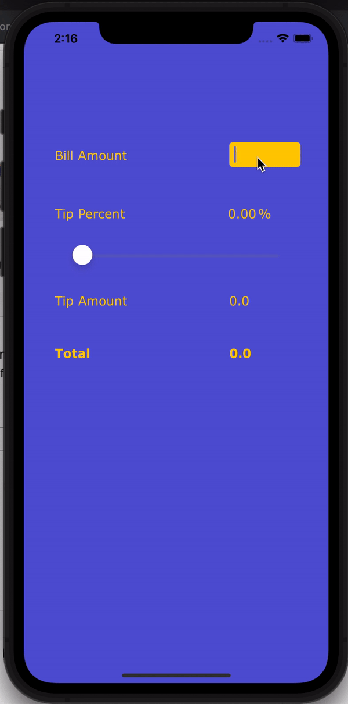

# iOS-Tip-Calculator

I learned how to change the colors of the app background, widget background, label text, etc. For example, this tip calculator
uses a dark grey background and yellow text for the UI. I also added the slider so the user could have more tip options.

